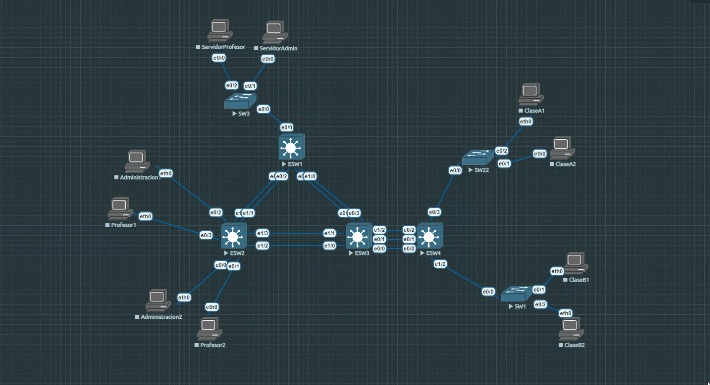
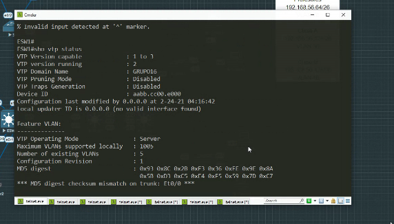
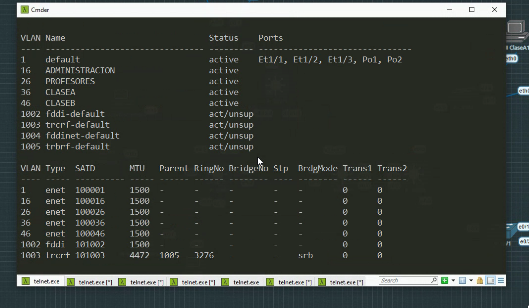
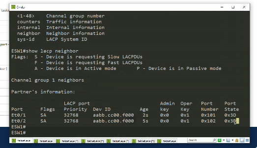
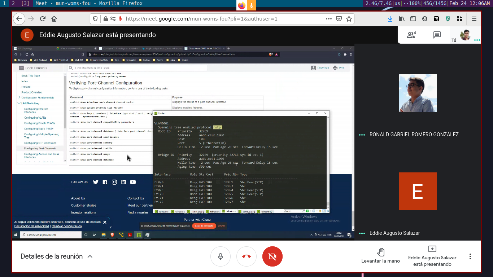
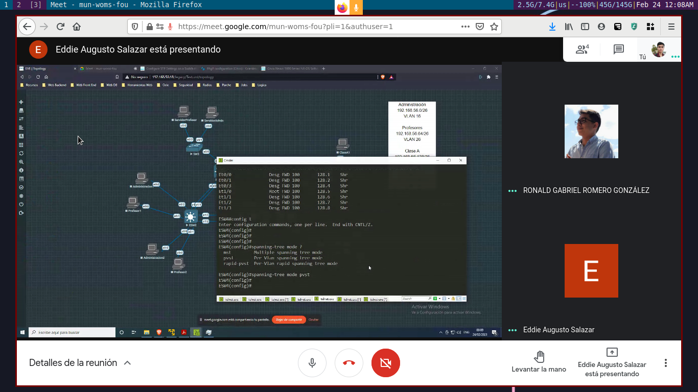
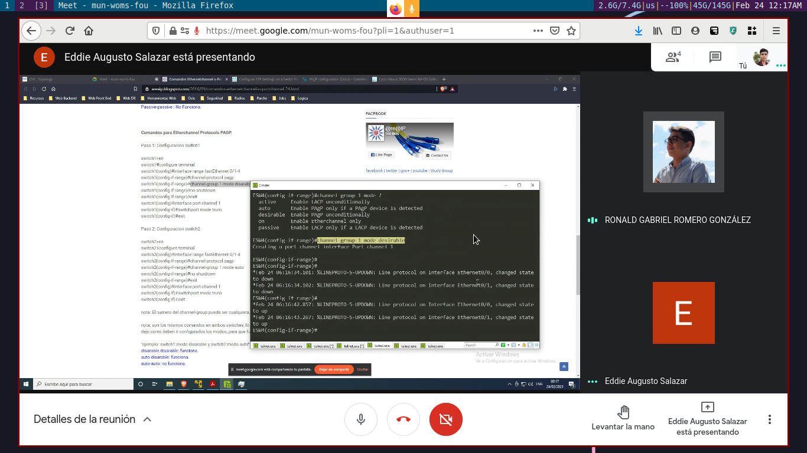

# Práctica 2

### Renato Josué Flores Pérez 	   - 201709244
### Ronald Gabriel Romero González - 201701048
### Eddie Augusto Salazar	   - 201700326

## Topología de red

## VTP

- conf t
- vtp domain Grupo16
- vtp password Grupo16
- vtp mode server/client (según aplique)
- end

Confirmamos la configuración del VTP con el comando sh vtp status

### Vlans creadas

Se crearon 4 Vlans para manejar las redes internas de la topología. Los comandos para configurar las Vlans
son los siguientes:
-  conf t
-  vlan {numero}
-  name {nombre}
-  end

Se crearon las siguientes Vlans:

- **Administración** - Vlan 16
- **Profesores** - Vlan 26
- **Clase A** - Vlan 36
- **Clase B** - Vlan 46

## Direcciones de Red

| Vlan | Direccion de Red | Primera Direccion Asignable | Ultima Direccion Asignable | Direccion de Broadcast | Gateway | Máscara de subred |
|:----------------:|:-------------:|:-------------:|:-------------:|:-------------:|:-----------------------:|:----------------------------:|
| 16 | 192.168.56.0 | 192.168.56.1 | 192.168.56.62 | 192.168.56.63 | 192.168.56.1 | 255.255.255.192 |
| 26 | 192.168.56.64 | 192.168.56.65 | 192.168.56.126 | 192.168.56.127 | 192.168.56.65 | 255.255.255.192 |
| 36 | 192.168.20.128 | 192.168.56.129 | 192.168.56.190 | 192.168.56.191 |192.168.56.129 | 255.255.255.192 |
| 46 | 192.168.10.192 | 192.168.56.193 | 192.168.10.254 | 192.168.56.255 |192.168.56.193 | 255.255.255.192 |

## Escenario

### Escenario 1

### Escenario 2

### Escenario 3

### Escenario 4

### Escenario 5

### Escenario 6

